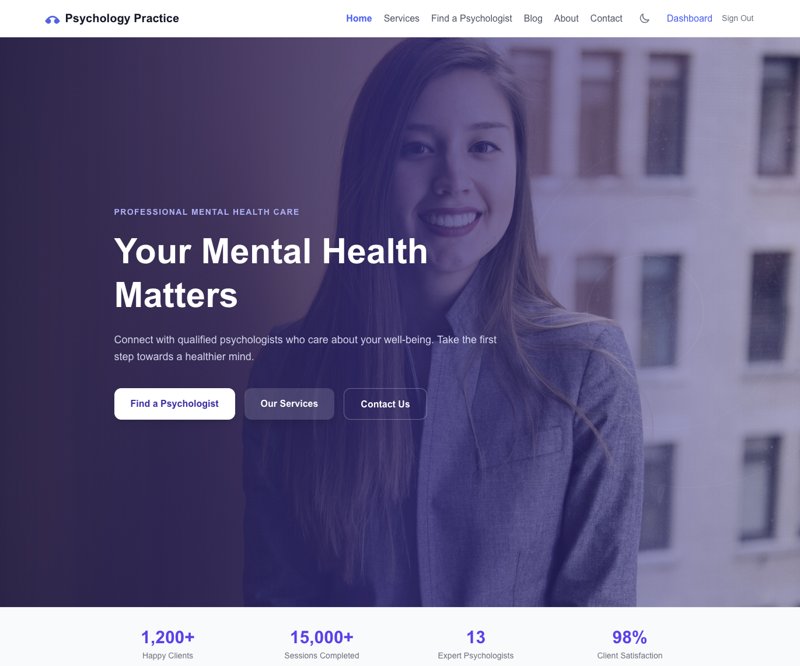

# Psychology Practice Platform

A full-featured, self-hosted psychology practice management platform built with Next.js 16, PostgreSQL, and Prisma. Supports public-facing pages with a CMS, client/psychologist/admin dashboards, appointment booking, a blog, support ticketing, newsletter management, and more.



---

## Features

| Area | Capabilities |
|------|-------------|
| **Public site** | Homepage, Services, Organisations, Blog, Psychologist directory, About, Contact, Legal pages — all CMS-driven |
| **Clients** | Browse & book psychologists, manage appointments, support tickets |
| **Psychologists** | Profile (bio, specialties, images via Unsplash), availability, appointments, blog posts |
| **Admin** | Full CMS for all public pages, user management, blog moderation, newsletter, contact inbox, support queue, site settings |
| **Auth** | Email + password (NextAuth v5), role-based access (Admin / Psychologist / Client) |
| **Email** | Nodemailer SMTP — contact replies, ticket notifications (configurable per-deployment) |
| **Rich text** | TinyMCE (CDN, API key optional — falls back to plain textarea) |
| **Images** | Unsplash picker — images downloaded locally, attribution stored in DB |

---

## Tech Stack

| Layer | Choice |
|-------|--------|
| Framework | Next.js 16 (App Router, Server Components) |
| Language | TypeScript |
| Styling | Tailwind CSS v4 |
| Database | PostgreSQL 14+ |
| ORM | Prisma 7 |
| Auth | NextAuth v5 (credentials, JWT) |
| Rich text | TinyMCE (CDN) |
| Images | Unsplash API |
| Email | Nodemailer 7 |
| Validation | Zod 4 |
| Runtime | Node.js ≥ 20 |

---

## Prerequisites

### Docker deployment (recommended)
- Docker Engine ≥ 24 + Docker Compose v2 plugin
- A domain name with DNS pointing to your server (for production)

### Bare-metal deployment
- Ubuntu 24.x / 25.x (or any systemd-based Linux)
- Node.js ≥ 20 (`nvm` recommended)
- PostgreSQL 14+
- PM2 (`npm install -g pm2`)
- Nginx (optional, for reverse proxy + SSL)

---

## Quick Start — Docker (Recommended)

### One-liner install

```bash
bash <(curl -fsSL https://raw.githubusercontent.com/marinnedea/psyhology-practice/main/scripts/docker-install.sh)
```

This script installs Docker if missing, clones the repo, generates secrets, starts the stack, and optionally loads demo data.

### Manual Docker setup

```bash
# 1. Clone
git clone https://github.com/marinnedea/psyhology-practice.git
cd psyhology-practice

# 2. Configure environment
cp .env.example .env.local
#    Edit .env.local — at minimum set DB_PASSWORD, NEXTAUTH_SECRET, NEXTAUTH_URL

# 3. Start the stack (DB + migrations + app)
docker compose up -d --build

# 4. (Optional) Load demo data
docker compose run --rm app npm run db:seed

# 5. Open in browser
open http://localhost:3000
```

---

## Quick Start — Development (local)

```bash
# 1. Clone and enter directory
git clone https://github.com/marinnedea/psyhology-practice.git
cd psyhology-practice

# 2. Install dependencies
npm install

# 3. Set up environment
cp .env.example .env.local
# Edit .env.local — set DATABASE_URL, NEXTAUTH_SECRET, NEXTAUTH_URL

# 4. Create PostgreSQL database (as superuser)
sudo -u postgres psql -f database/setup.sql
# Then update .env.local with your chosen DB password

# 5. Run migrations
npx prisma migrate dev

# 6. (Optional) Load demo data
npm run db:seed

# 7. Start dev server
npm run dev
# → http://localhost:3000
```

---

## Production Deployment — Bare-metal

### Guided installer (Ubuntu)

```bash
git clone https://github.com/marinnedea/psyhology-practice.git
cd psyhology-practice
bash scripts/install.sh
```

The installer will:
1. Check Node.js ≥ 20, npm, and psql are available
2. Create the PostgreSQL user and database
3. Generate `.env.local` with a random `NEXTAUTH_SECRET`
4. Run `npm ci`, `prisma migrate deploy`, and `npm run build`
5. Start the app with PM2

### Manual steps

```bash
# Database
sudo -u postgres psql -f database/setup.sql   # edit password first

# Environment
cp .env.example .env.local
# Fill: DATABASE_URL, NEXTAUTH_SECRET, NEXTAUTH_URL

# Dependencies + migrations + build
npm ci
npx prisma migrate deploy
npm run build

# Start with PM2
pm2 start npm --name psych-app -- start
pm2 save
pm2 startup   # enable auto-restart on reboot
```

### Nginx reverse proxy

Example `/etc/nginx/sites-available/psych-app`:

```nginx
server {
    listen 80;
    server_name app.your-domain.com;

    location / {
        proxy_pass         http://localhost:3000;
        proxy_http_version 1.1;
        proxy_set_header   Upgrade $http_upgrade;
        proxy_set_header   Connection 'upgrade';
        proxy_set_header   Host $host;
        proxy_set_header   X-Real-IP $remote_addr;
        proxy_set_header   X-Forwarded-For $proxy_add_x_forwarded_for;
        proxy_set_header   X-Forwarded-Proto $scheme;
        proxy_cache_bypass $http_upgrade;
    }
}
```

Then enable SSL with Let's Encrypt:
```bash
sudo certbot --nginx -d app.your-domain.com
```

---

## Environment Variables

| Variable | Description | Required |
|----------|-------------|----------|
| `DATABASE_URL` | PostgreSQL connection string | ✅ |
| `NEXTAUTH_SECRET` | Token signing secret (`openssl rand -base64 32`) | ✅ |
| `NEXTAUTH_URL` | Canonical app URL (no trailing slash) | ✅ |
| `NEXT_PUBLIC_TINYMCE_API_KEY` | TinyMCE editor key ([tiny.cloud](https://www.tiny.cloud)) | optional |
| `NEXT_PUBLIC_UNSPLASH_ACCESS_KEY` | Unsplash image picker key ([unsplash.com/developers](https://unsplash.com/developers)) | optional |

> For Docker Compose, `DATABASE_URL` is constructed automatically from `DB_PASSWORD` in `.env.local`. See `docker-compose.yml`.

---

## Database

### Schema overview

| Model | Description |
|-------|-------------|
| `User` | All users — admin, psychologist, client. Holds credentials, role, approval status |
| `PsychologistProfile` | Extended profile for psychologists — bio, specialties, social links, profile image |
| `Service` | Services offered on the platform (price, duration) |
| `PsychologistService` | Which services a psychologist offers (optional custom price) |
| `Availability` | Weekly time slots per psychologist |
| `Appointment` | Booked sessions linking client ↔ psychologist ↔ service |
| `BlogPost` | Blog articles authored by psychologists, moderated by admin |
| `BlogCategory` | Blog categories |
| `PageSection` | CMS sections for all public pages (homepage, services, about, contact, organisations, etc.) |
| `Testimonial` | Client testimonials shown on the homepage |
| `NewsletterSubscriber` | Email subscribers |
| `ContactMessage` | Inbound contact form submissions, with reply tracking |
| `Ticket` | Support tickets (client/psychologist → admin) |
| `TicketMessage` | Messages within a ticket thread |
| `SiteSetting` | Key-value store for site-wide settings (SMTP, reCAPTCHA, feature flags) |
| `Image` | Locally-stored images with Unsplash attribution |
| `Account` / `Session` | NextAuth adapter tables |

### Migrations

| Migration | Description |
|-----------|-------------|
| `20260316112717_init` | Initial schema — all core tables |
| `20260316133323_add_site_settings` | `SiteSetting` key-value store |
| `20260316000001_blog-status-and-upload` | `BlogPostStatus` enum, `Image` model, blog status workflow |
| `20260317000001_add_testimonials` | `Testimonial` model |
| `20260317000002_add_tickets` | `Ticket`, `TicketMessage` models and enums |
| `20260317000003_contact_reply` | `repliedAt` + `replyBody` columns on `ContactMessage` |

The full consolidated DDL is in [`database/schema.sql`](database/schema.sql) for reference. Always use `npx prisma migrate deploy` for actual deployments.

### Seed / demo data

```bash
npm run db:seed          # or: docker compose run --rm app npm run db:seed
```

Creates 1 admin, 13 psychologists, 23 clients, 6 services, 15 blog posts, appointments, testimonials, and default page sections.

**Default credentials after seeding:**

| Role | Email | Password |
|------|-------|----------|
| Admin | `admin@psychpractice.com` | `Admin123#` |
| Psychologist | `dr.sofia.andreou@psychpractice.com` | `Psych123#` |
| Client | `alice.johnson@example.com` | `Client123#` |

> Change these immediately after first login on a production deployment.

---

## Project Structure

```
.
├── app/
│   ├── (auth)/              # Login, Register pages
│   ├── (dashboard)/         # Role-gated dashboard (admin / psychologist / client)
│   │   ├── admin/           # Admin editors: pages, blog, users, settings, tickets…
│   │   ├── psychologist/    # Profile, availability, appointments, blog
│   │   └── client/          # Profile, appointments, support
│   ├── api/                 # API routes (auth, tickets, page-sections, SMTP test…)
│   ├── blog/                # Public blog listing + post pages
│   ├── contact/             # Contact page + form
│   ├── psychologists/       # Public directory + detail pages
│   ├── services/            # Services page + /organisations sub-page
│   └── […other public pages]
├── components/
│   ├── dashboard/           # Admin/dashboard UI components and page editors
│   ├── tickets/             # Ticket list, thread, admin queue
│   ├── auth/                # Login, Register forms
│   └── […other components]
├── lib/                     # Prisma client, auth helpers, settings, email
├── prisma/
│   ├── schema.prisma
│   ├── seed.ts
│   └── migrations/
├── database/
│   ├── setup.sql            # PostgreSQL user + DB creation
│   └── schema.sql           # Full DDL reference
├── scripts/
│   ├── install.sh           # Bare-metal Ubuntu installer
│   └── docker-install.sh    # One-liner Docker installer
├── public/uploads/          # Locally stored images (.gitkeep tracked; content gitignored)
├── Dockerfile
├── docker-compose.yml
└── .env.example
```

---

## Development Workflow

```bash
npm run dev           # Start dev server on :3000 with hot reload
npm run build         # Production build
npm run lint          # ESLint

npx prisma studio     # Visual DB browser on :5555
npx prisma migrate dev --name <name>   # Create a new migration
npm run db:seed       # Re-seed the database (additive)
```

---

## Contributing

Pull requests are welcome. For major changes, open an issue first to discuss the approach.

This project is primarily a learning platform and demonstration of modern Next.js patterns. Issues and feature suggestions are tracked in the GitHub Issues tab.

---

## Licence

MIT — see [LICENSE](LICENSE) file (if present). Feel free to fork and adapt for your own psychology practice or similar healthcare platform.
